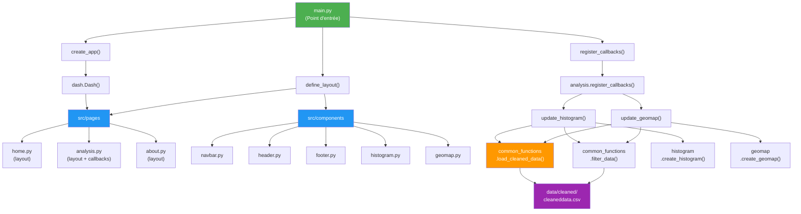

# Projet Data – Dashboard Interactif

> Dashboard d'analyse de données publiques (Open Data)  
> Développé en Python avec Dash et Plotly

---

## Table des matières

- [User Guide](#user-guide)
- [Data](#data)
- [Developer Guide](#developer-guide)
- [Rapport d'analyse](#rapport-danalyse)
- [Copyright](#copyright)

---

## User Guide

### Prérequis

- **Python** 3.9 ou supérieur
- **pip** (gestionnaire de packages Python)
- **git** (optionnel, pour cloner le repository)

### Installation et déploiement

#### 1. Cloner le repository (si le projet est sur GitHub)

```bash
git clone https://github.com/votre-username/data_project.git
cd data_project
```

#### 2. Créer un environnement virtuel (recommandé)

```bash
# Sur Linux / macOS
python3 -m venv .venv
source .venv/bin/activate

# Sur Windows
python -m venv .venv
.venv\Scripts\activate
```

#### 3. Installer les dépendances

```bash
python -m pip install -r requirements.txt
```

#### 4. Récupérer les données brutes (important !)

Avant de lancer le dashboard, il faut récupérer les données depuis la source :

```bash
python -m src.utils.get_data
```

Cela téléchargera automatiquement les données et les sauvegardera dans `data/raw/rawdata.csv`.

#### 5. Nettoyer les données

Ensuite, nettoyez les données pour préparer le dashboard :

```bash
python -m src.utils.clean_data
```

Cela créera `data/cleaned/cleaneddata.csv`.

#### 6. Lancer le dashboard

```bash
python main.py
```

Le dashboard démarre sur `http://localhost:8050` par défaut.

### Utilisation du dashboard

1. **Ouvrir dans le navigateur** : Accédez à `http://localhost:8050`
2. **Navigation multi-pages** : Utilisez la barre de navigation pour :
   - **Accueil** : Présentation du sujet et KPIs globaux
   - **Analyse** : Histogrammes, cartes et filtres interactifs
   - **À propos** : Crédits, sources et méthodologie
3. **Interactivité** : Les graphiques réagissent aux filtres sélectionnés en temps réel
4. **Arrêter le serveur** : `Ctrl+C` dans le terminal

---

## Data

### Sources de données

**A REMPLIR** : Indiquez ici votre source de données open data.

Exemple :

| Aspect | Détail |
|--------|--------|
| **Source** | [data.gouv.fr](https://www.data.gouv.fr) ou autre API public |
| **URL de téléchargement** | `https://example.com/dataset.csv` |
| **Format** | CSV / JSON / XLS |
| **Licence** | Licence Ouverte / CC-BY / ODbL |
| **Dernière mise à jour** | [DATE] |

### Structure des données

**Format** : Tableur (observations × variables)

| Variable | Type | Description |
|----------|------|-------------|
| (À compléter) | numérique/catégoriel | Description |
| (À compléter) | ... | ... |

### Caractéristiques requises

- [x] **Nombre d'observations (OBS)** : Doit être > 100 (typiquement plusieurs centaines)
- [x] **Variable numérique non catégorielle** : Pour l'histogramme
- [x] **Géolocalisation** : Latitude/longitude ou associée à une région/pays

### Pipeline de traitement des données

```
data/raw/rawdata.csv
        ↓
  [get_data.py]  ← Télécharge et sauvegarde brut
        ↓
data/raw/rawdata.csv (stockage)
        ↓
  [clean_data.py]  ← Nettoie, normalise, agrège
        ↓
data/cleaned/cleaneddata.csv (prêt pour dashboard)
        ↓
  [Dashboard Dash]  ← Histogramme + Carte géolocalisée
```

---

## Developer Guide

### Architecture du code

L'application suit une architecture **modulaire** avec séparation des responsabilités :

```
FRONTEND                BACKEND
─────────────────       ─────────────────
Pages (Dash layouts)    Utilitaires (pandas)
  ↓                       ↓
Composants graphiques ← Données nettoyées
  ↓                       ↓
Callbacks (interactivité) Logique applicative
```

#### Diagramme d'architecture (Mermaid)



### Hiérarchie des fichiers

```
data_project/
│
├── main.py                          # Point d'entrée
├── config.py                        # Configuration centralisée
├── requirements.txt                 # Dépendances
├── README.md                        # Cette documentation
│
├── data/
│   ├── raw/
│   │   └── rawdata.csv             # Données brutes (non modifiées)
│   └── cleaned/
│       └── cleaneddata.csv         # Données nettoyées (prêtes)
│
├── src/
│   ├── __init__.py
│   │
│   ├── components/                  # Composants Dash réutilisables
│   │   ├── __init__.py
│   │   ├── header.py               # En-tête du dashboard
│   │   ├── navbar.py               # Barre de navigation
│   │   ├── footer.py               # Pied de page
│   │   ├── histogram.py            # Graphique histogramme (REQUIS)
│   │   └── geomap.py               # Carte géolocalisée (REQUIS)
│   │
│   ├── pages/                       # Pages du dashboard
│   │   ├── __init__.py
│   │   ├── home.py                 # Page d'accueil
│   │   ├── analysis.py             # Page d'analyse (filtres + graphiques)
│   │   └── about.py                # Page 'À propos'
│   │
│   └── utils/                       # Logique métier et données
│       ├── __init__.py
│       ├── get_data.py             # Télécharge les données brutes
│       ├── clean_data.py           # Nettoie et normalise
│       └── common_functions.py     # Utilitaires partagés
│
├── tests/                           # Tests unitaires
│   ├── __init__.py
│   ├── test_get_data.py
│   ├── test_clean_data.py
│   └── test_common_functions.py
│
├── images/                          # Images pour le README (si nécessaire)
│
└── .gitignore                       # Fichiers à ignorer dans git
```

### Flux de données

#### 1. Récupération des données (`get_data.py`)

```
Internet / API
    ↓
download_data()  → DataFrame brut (pas de modification)
    ↓
save_raw_data()  → data/raw/rawdata.csv
```

#### 2. Nettoyage des données (`clean_data.py`)

```
data/raw/rawdata.csv
    ↓
load_raw_data()
    ↓
remove_duplicates()
    ↓
handle_missing_values()
    ↓
normalize_columns()  (renommage, castage types)
    ↓
save_cleaned_data()
    ↓
data/cleaned/cleaneddata.csv
```

#### 3. Dashboard (`main.py` + pages + composants)

```
Backend
─────────────────────────────
common_functions.load_cleaned_data()
    ↓
common_functions.filter_data()  (critères utilisateur)
    ↓
common_functions.aggregate_data()  (calculs pour graphiques)
    ↓
Frontend
─────────────────────────────
analysis.layout()
    ├─ dcc.Dropdown() / dcc.Slider()  (filtres)
    ├─ dcc.Graph("histogram")
    └─ dcc.Graph("geomap")
    
Callbacks
─────────────────────────────
@app.callback(Output("histogram", "figure"), Input("filtre", "value"))
def update_histogram(selected_value):
    df = load_cleaned_data()
    df = filter_data(df, ...)
    return create_histogram(df, ...)
```

### Ajouter une nouvelle page

1. **Créer le fichier** `src/pages/new_page.py` :

```python
from dash import html, dcc

def layout() -> html.Div:
    """Layout de la nouvelle page."""
    # TODO: implémenter le layout
    pass

def register_callbacks(app) -> None:
    """Callbacks spécifiques à cette page."""
    # TODO: implémenter les callbacks
    pass
```

2. **Importer dans `main.py`** :

```python
from src.pages import home, analysis, about, new_page
```

3. **Enregistrer les callbacks dans `main.py`** :

```python
def register_callbacks(app):
    home.register_callbacks(app)
    analysis.register_callbacks(app)
    about.register_callbacks(app)
    new_page.register_callbacks(app)
```

4. **Ajouter le lien dans la navbar** (`src/components/navbar.py`)

### Ajouter un nouveau graphique

1. **Créer le composant** `src/components/new_chart.py` :

```python
import plotly.graph_objects as go
import pandas as pd

def create_new_chart(df: pd.DataFrame) -> go.Figure:
    """Crée un nouveau graphique."""
    # TODO: implémenter avec plotly
    pass
```

2. **Utiliser dans une page** (`src/pages/analysis.py`) :

```python
from src.components.new_chart import create_new_chart

# Dans layout():
dcc.Graph(id="new-chart", figure=create_new_chart(df))
```

### Bonnes pratiques d'implémentation

#### Imports

```python
# Préférer les imports relatifs pour les modules locaux
from src.utils.common_functions import load_cleaned_data
from src.components.histogram import create_histogram

# Les imports absolus pour les packages externes
import pandas as pd
import plotly.express as px
```

#### Docstrings et typing

```python
def ma_fonction(df: pd.DataFrame, colonne: str) -> pd.DataFrame:
    """
    Description courte et claire.
    
    Args:
        df: Description du paramètre
        colonne: Description
    
    Returns:
        Description du retour
    
    Raises:
        ValueError: Si colonne n'existe pas
    """
    pass
```

#### Gestion des erreurs

```python
try:
    df = pd.read_csv(config.DATA_CLEAN)
except FileNotFoundError:
    print("Erreur: Lancez d'abord 'python -m src.utils.clean_data'")
except Exception as e:
    print(f"Erreur imprévue: {e}")
```

### Lancer les tests unitaires

```bash
# Installer pytest (si pas déjà fait)
python -m pip install pytest

# Lancer tous les tests
pytest tests/

# Lancer un test spécifique
pytest tests/test_clean_data.py
```

---

## Rapport d'analyse

**A REMPLIR** : Cette section doit contenir les conclusions extraites des données.

### 1. Résumé exécutif

<!-- Résumé en 2-3 phrases du sujet et des principal conclusions -->

### 2. Questions clés explorées

- **Question 1 ?**
  - Conclusion : ...
  
- **Question 2 ?**
  - Conclusion : ...

### 3. Visualisations principales

#### Histogramme
- Qu'observe-t-on ?
- Quels sont les patterns/distribution ?
- Quelle colonne est représentée ?

#### Carte géolocalisée
- Quelles régions/pays ressortent ?
- Quelles corrélations géographiques observe-t-on ?

### 4. Insights clés

- **Point clé 1** : ...
- **Point clé 2** : ...
- **Point clé 3** : ...

### 5. Limitations et hypothèses

- Limitation 1 : ...
- Hypothèse 1 : ...

---

## Copyright

### Déclaration d'originalité

Je déclare sur l'honneur que le code source fourni a été produit par **nous-même** (SAMBA, MOUHAMED),  à l'ai de l'IA générative particulièrement avec Claude Code, à l'exception des lignes énumérées ci-dessous.

### Emprunts déclarés

#### Aucun emprunt déclaré à ce jour

> Toute ligne non déclarée ci-dessus est réputée être produite par l'auteur du projet (SAMBA, MOUHAMED).  
> L'absence ou l'omission de déclaration sera considérée comme du plagiat.

### Ressources externes utilisées

| Resource | Lien | Usage |
|----------|------|-------|
| Dash documentation | https://dash.plotly.com | Framework web |
| Plotly documentation | https://plotly.com/python | Graphiques interactifs |
| Pandas documentation | https://pandas.pydata.org | Manipulation de données |
| Cours ESIEE | https://perso.esiee.fr | Références pédagogiques |

### Auteurs du projet

- **SAMBA** - Développement frontend, pages, composants
- **MOUHAMED** - Développement backend, données, analyses

---

## Support et questions

Pour toute question sur le déploiement ou l'utilisation du dashboard :

1. Vérifiez que `python main.py` lance sans erreur
2. Assurez-vous que `requirements.txt` est installé (`pip check`)
3. Vérifiez que les données existent : `ls -la data/cleaned/cleaneddata.csv`
4. Consultez la console pour les messages d'erreur détaillés

---

## Licence

Ce projet utilise des données Open Data sous licence [À SPÉCIFIER]. Cf. section Data ci-dessus.

---

**Dernière mise à jour** : 8 avril 2026  
**Version** : 1.0
