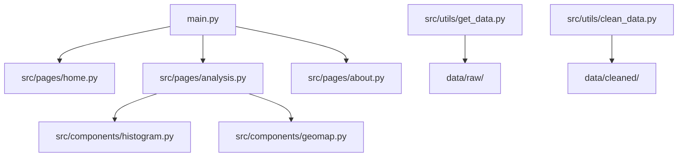

# Projet Data

## User Guide
> Instructions pour déployer et lancer le dashboard sur une autre machine.

```bash
git clone <URL_publique_du_repo>
cd data_project
python -m pip install -r requirements.txt
python main.py
```

## Data
> Décrire les sources de données utilisées et les liens vers les ressources.

## Developer Guide
> Architecture du code et instructions pour ajouter une page ou un graphique.



## Rapport d'analyse
> Principales conclusions extraites des données.

## Copyright
> Je déclare sur l'honneur que le code fourni a été produit par nous-mêmes.
