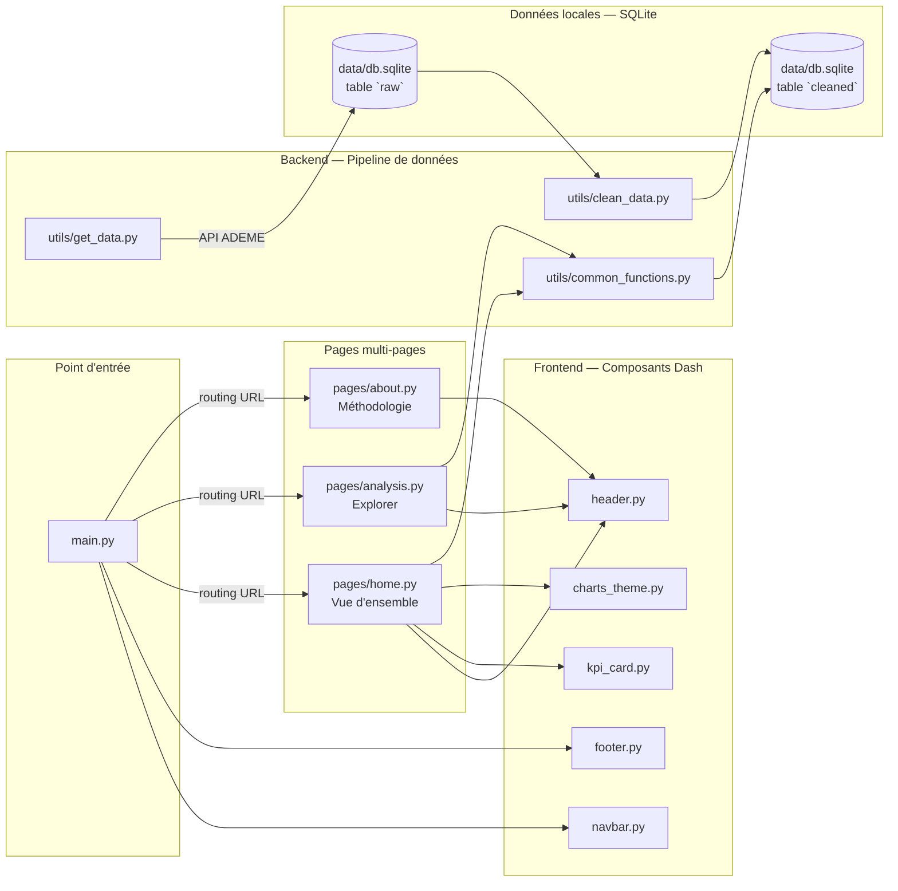

# GES Insight

> Tableau de bord interactif des Bilans Carbone réglementaires (BEGES)
> publiés par les organisations françaises sur la plateforme ADEME.

### 🌐 Démo en ligne

> ### [▶ Ouvrir le dashboard — ges-insight.onrender.com](https://ges-insight.onrender.com/)
>
> Déployé sur Render (plan gratuit). Premier accès après une période d'inactivité : ~30 s de réveil, puis instantané.

---

GES Insight donne une vue d'ensemble de la déclaration des émissions de gaz
à effet de serre en France : qui publie son bilan, dans quelles régions, à
quelle hauteur, et selon quelle décomposition entre les Scopes 1, 2 et 3 du
référentiel BEGES.

| Indicateur | Valeur |
|---|---|
| Bilans BEGES analysés | **9 991** |
| Organisations distinctes (SIREN) | **6 817** |
| Émissions cumulées | **7,8 Gt CO₂eq** |
| Période couverte | **2009 — 2026** |
| Couverture géographique | **France métropolitaine et DROM-COM** |

**Stack imposée par le cahier des charges** : Python, pandas, Dash, Plotly.

---

## Sommaire

- [Aperçu](#aperçu)
- [User Guide](#user-guide)
- [Data](#data)
- [Developer Guide](#developer-guide)
- [Rapport d'analyse](#rapport-danalyse)
- [Copyright](#copyright)
- [Auteurs](#auteurs)

---

## Aperçu

Le tableau de bord est structuré en trois pages :

- **Vue d'ensemble** — quatre indicateurs clés (bilans, organisations,
  émissions cumulées, période), graphique d'évolution annuelle des
  publications BEGES et donut de répartition par type de structure.
- **Explorer** — page d'exploration interactive (en cours d'intégration) :
  carte choroplèthe régionale, histogramme des émissions et décomposition
  par scope, synchronisés sur trois filtres (année, région, type).
- **Méthodologie** — glossaire du référentiel BEGES, schéma du pipeline
  de données et déclarations de copyright.

Direction artistique : palette terre et vert profond, typographie éditoriale
(Fraunces serif + DM Sans + JetBrains Mono pour les chiffres tabulaires),
inspiration des publications institutionnelles françaises.

---

## User Guide

### Accès direct (sans installation)

Le dashboard est déployé en ligne et consultable immédiatement :

**🔗 [https://ges-insight.onrender.com](https://ges-insight.onrender.com/)**

Hébergement Render (plan gratuit) — le service s'endort après 15 min
d'inactivité, le premier accès peut donc prendre environ 30 secondes le
temps du réveil, puis la navigation devient instantanée.

### Prérequis

- Python **3.9** ou supérieur (testé en CI sur Python 3.9 / 3.10 / 3.11)
- [`uv`](https://docs.astral.sh/uv/) — gestionnaire d'environnement et de
  dépendances **imposé par le cahier des charges**. Installation :
  ```bash
  curl -LsSf https://astral.sh/uv/install.sh | sh   # macOS / Linux
  pip install uv                                    # alternative cross-platform
  ```
- Connexion internet **uniquement** lors du premier téléchargement des
  données ; le dashboard fonctionne ensuite hors ligne.

### Installation (procédure d'évaluation)

```bash
git clone https://github.com/samba-diallo/Data_Project_DIALLO_DIOP.git
cd Data_Project_DIALLO_DIOP
uv sync
```

`uv sync` lit `pyproject.toml` et `uv.lock`, crée automatiquement un
environnement virtuel `.venv/` et installe la version exacte de chaque
dépendance — pas de `pip install` manuel à faire.

### Préparation des données

Les données sont stockées dans la base SQLite unique `data/db.sqlite`
(deux tables : `raw` et `cleaned`), conformément au cahier des charges.

```bash
# 1. Télécharger le fichier brut depuis l'API ADEME -> table `raw`
uv run python -m src.utils.get_data

# 2. Nettoyer les données -> table `cleaned`
uv run python -m src.utils.clean_data
```

Résultat attendu :

```
data/
└── db.sqlite                   (~56 Mo, deux tables :
                                 raw      : 10 000 lignes × 104 colonnes  -- données ADEME brutes
                                 cleaned  :  9 990 lignes ×  40 colonnes  -- prêt pour le dashboard)
```

### Lancer le dashboard

```bash
uv run python main.py
```

Le serveur démarre par défaut sur **http://127.0.0.1:8050**.
Pour arrêter : `Ctrl + C` dans le terminal.

### Variables d'environnement (optionnel)

| Variable | Défaut | Usage |
|---|---|---|
| `HOST` | `127.0.0.1` | Adresse d'écoute du serveur |
| `PORT` | `8050` | Port d'écoute |
| `DEBUG` | `False` | Mode debug Dash (à n'activer qu'en développement local) |

Exemple pour exposer le dashboard à un conteneur Docker :

```bash
HOST=0.0.0.0 PORT=8080 uv run python main.py
```

---

## Data

### Source

| Champ | Détail |
|---|---|
| Producteur | ADEME — Agence de la Transition Écologique |
| Jeu de données | [Bilans GES](https://data.ademe.fr/datasets/bilan-ges) |
| Format choisi | Excel (`.xlsx`), feuille `données` |
| URL d'export | `https://data.ademe.fr/api/explore/v2.1/catalog/datasets/bilan-ges/exports/xlsx?limit=-1` |
| Licence | Licence Ouverte v2.0 — Etalab |
| Fréquence de mise à jour | Bimensuelle côté ADEME ; instantané embarqué dans le dépôt pour fonctionnement hors ligne |
| Couverture géographique | France métropolitaine + DROM-COM |
| Couverture temporelle | 2009 — 2026 |

### Structure du dataset nettoyé

Le pipeline `clean_data.py` réduit le fichier brut (104 colonnes) à
**40 colonnes** organisées en quatre groupes.

**Identification et localisation de l'organisation déclarante** (14 colonnes)

| Colonne | Type | Description |
|---|---|---|
| `id` | str | Identifiant unique du bilan ADEME |
| `annee_reporting` | int | Année du bilan publié |
| `annee_reference` | int (nullable) | Année de référence pour la trajectoire de réduction |
| `region` | str | Région française (compatible GeoJSON INSEE) |
| `code_departement`, `departement` | str | Département de la déclaration |
| `type_structure` | str | Entreprise / Établissement public / Collectivité / État / Association |
| `type_collectivite` | str (nullable) | Sous-type pour les collectivités |
| `raison_sociale` | str | Nom officiel de l'organisation |
| `siren` | str | Identifiant SIREN principal |
| `code_naf`, `libelle_naf` | str | Code NAF / APE et son libellé |
| `population` | int (nullable) | Population concernée pour les collectivités |
| `methode_beges` | str | Version de la méthodologie BEGES utilisée (V4 ou V5) |

**Postes d'émissions BEGES** (22 colonnes, en `tCO₂eq`)

Conformes aux postes officiels du référentiel BEGES :

- Scope 1 — émissions directes : `emissions_p1_1` à `emissions_p1_5`
- Scope 2 — énergie achetée : `emissions_p2_1`, `emissions_p2_2`
- Scope 3 — chaîne de valeur : `emissions_p3_1` à `emissions_p3_5`,
  `emissions_p4_1` à `emissions_p4_5`, `emissions_p5_1` à `emissions_p5_4`,
  `emissions_p6_1`

**Totaux calculés** (4 colonnes) : `total_scope_1`, `total_scope_2`,
`total_scope_3`, `total_emissions` — somme par ligne, NaN ignorés.

### Pipeline de traitement

```text
API ADEME (xlsx)
        ↓ get_data.download_data()
data/db.sqlite — table `raw`
        ↓ clean_data.load_raw_data()           (SELECT * FROM raw)
        ↓ remove_duplicates()                  (dédoublonnage par Id ADEME)
        ↓ handle_missing_values()              (drop si Région ou Année manquante)
        ↓ normalize_columns()                  (sélection des 36 colonnes utiles,
        ↓                                       renommage snake_case, cast Int64
        ↓                                       nullable, strip caractères Unicode PUA,
        ↓                                       calcul des totaux par scope)
        ↓ save_cleaned_data()
data/db.sqlite — table `cleaned`
        ↓ common_functions.load_cleaned_data() (SELECT * FROM cleaned)
        ↓ filter_data() / aggregate_data()
Dashboard Dash (pages/home, pages/analysis, pages/about)
```

### Conformité aux exigences du cahier des charges

| Exigence | Réponse |
|---|---|
| Nombre d'observations > plusieurs centaines | 9 991 bilans (✓) |
| Au moins une variable numérique non catégorielle | 22 postes d'émissions + 4 totaux (✓) |
| Géolocalisation possible | Région + département pour chaque bilan, jointure avec GeoJSON France (✓) |

---

## Developer Guide

### Architecture des modules

L'application sépare clairement **backend** (utilitaires de données) et
**frontend** (composants et pages Dash). Le routing multi-pages est piloté
par un dictionnaire `ROUTES` dans `main.py`.



### Arborescence

```
data_project/
├── main.py                       Point d'entrée Dash, routing multi-pages
├── config.py                     Chemins, URL ADEME, host/port, mode debug
├── pyproject.toml                Métadonnées + dépendances (PEP 621, uv)
├── uv.lock                       Versions exactes résolues par uv (généré)
├── requirements.txt              Fallback pip (utilisé par Render uniquement)
├── README.md                     Présent fichier
├── .gitignore
│
├── data/
│   └── db.sqlite                 Base SQLite unique :
│                                   table `raw`     -> 10 000 × 104 (données ADEME)
│                                   table `cleaned` ->  9 990 ×  40 (prêt dashboard)
│
├── src/
│   ├── components/               Composants Dash réutilisables
│   │   ├── navbar.py             Barre de navigation
│   │   ├── header.py             En-tête éditorial paramétrable
│   │   ├── footer.py             Pied de page (sources, équipe, copyright)
│   │   ├── kpi_card.py           Carte d'indicateur clé
│   │   └── charts_theme.py       Helper apply_theme() pour les figures Plotly
│   │
│   ├── pages/                    Pages multi-pages
│   │   ├── home.py               Vue d'ensemble : KPIs + 2 graphiques
│   │   ├── analysis.py           Explorer (intégration en cours)
│   │   └── about.py              Méthodologie
│   │
│   └── utils/                    Backend et utilitaires partagés
│       ├── get_data.py           Téléchargement idempotent du fichier ADEME
│       ├── clean_data.py         Pipeline de nettoyage et calcul des totaux
│       └── common_functions.py   load / filter / aggregate
│
├── tests/                        Tests unitaires pytest (signatures et docstrings)
│   ├── test_get_data.py
│   ├── test_clean_data.py
│   └── test_common_functions.py
│
└── assets/
    └── style.css                 Design system : tokens, typo, navbar, footer,
                                  KPI cards, accessibilité (focus-visible,
                                  prefers-reduced-motion)
```

### Lancer les tests unitaires

Les tests vérifient les signatures, les annotations de type et la
présence des docstrings sur les fonctions backend.

```bash
uv run pytest tests/ -v
```

Suite : **108 tests**, exécutés en ~5 s. La matrice CI GitHub Actions
relance la suite sur Python 3.9, 3.10 et 3.11 à chaque push.

### Ajouter une nouvelle page

1. Créer `src/pages/ma_page.py` exposant deux fonctions :

```python
from dash import html
from src.components.header import create_header

def layout() -> html.Div:
    return html.Div(
        className="page-container",
        children=[
            create_header(kicker="Ma page", title="Titre éditorial"),
            # contenu de la page
        ],
    )

def register_callbacks(app) -> None:
    pass  # callbacks éventuels
```

2. Référencer la page dans `main.py` :

```python
from src.pages import home, analysis, about, ma_page

ROUTES = {
    "/":             home,
    "/explorer":     analysis,
    "/methodologie": about,
    "/ma-page":      ma_page,
}
```

3. Ajouter le lien dans la navbar (`src/components/navbar.py`,
   constante `NAV_LINKS`).

### Ajouter un nouveau graphique Plotly

Tous les graphiques utilisent le helper `apply_theme()` pour garantir une
cohérence visuelle (palette, typographie, marges, hover) avec le reste
de l'interface.

```python
import plotly.express as px
from src.components.charts_theme import apply_theme, COLORS

def create_my_chart(df):
    fig = px.line(df, x="annee_reporting", y="total_emissions")
    fig.update_traces(line=dict(color=COLORS["primary"], width=2.5))
    return apply_theme(fig, height=380)
```

### Conventions de code

- Annotations de type sur toutes les fonctions et classes
- Docstrings au format Google (`Args` / `Returns` / `Raises`)
- Commentaires en français pour expliquer le _pourquoi_ des choix non triviaux
- snake_case pour les variables et fonctions, ALL_CAPS pour les constantes
- Linter recommandé : [`ruff`](https://docs.astral.sh/ruff/)

---

## Rapport d'analyse

### Synthèse exécutive

Sur la période 2009 — 2026, **9 991 bilans BEGES** ont été publiés en France
par **6 817 organisations distinctes**, totalisant **7,8 Gt CO₂eq** déclarées.
Le rythme des publications annuelles a été multiplié par plus de vingt depuis
2014, principalement porté par l'élargissement progressif des obligations
réglementaires (loi Grenelle II, loi Climat et Résilience).

Trois constats structurent cette analyse :

1. **Forte concentration géographique** : l'Île-de-France représente à elle
   seule 63 % des émissions cumulées déclarées, devant l'Occitanie (11 %)
   et les Hauts-de-France (5 %).
2. **Distribution extrêmement asymétrique** : la médiane des bilans
   (5 600 tCO₂eq) est près de 600 000 fois inférieure au plus gros
   déclarant (3,3 milliards de tCO₂eq). Cela impose une lecture en échelle
   logarithmique pour visualiser la distribution.
3. **Domination des entreprises** : 70 % des bilans publiés émanent
   d'entreprises privées, suivies par les établissements publics (17 %)
   et les collectivités territoriales (7 %).

### Ampleur et concentration géographique

Top 5 des régions par émissions cumulées déclarées :

| Région | Émissions cumulées | Part du total |
|---|---|---|
| Île-de-France | 4,95 Gt CO₂eq | 63,3 % |
| Occitanie | 0,86 Gt CO₂eq | 11,0 % |
| Hauts-de-France | 0,39 Gt CO₂eq | 5,0 % |
| Nouvelle-Aquitaine | 0,32 Gt CO₂eq | 4,1 % |
| Pays de la Loire | 0,26 Gt CO₂eq | 3,3 % |

Cette concentration s'explique par la densité des sièges sociaux d'entreprises
en Île-de-France et par la présence de quelques très grands déclarants
industriels (énergie, transport, métallurgie) dont l'empreinte carbone
remonte au siège francilien plutôt qu'aux sites de production.

### Profil des organisations déclarantes

| Type de structure | Part des bilans |
|---|---|
| Entreprise | 70,4 % |
| Établissement public | 16,8 % |
| Collectivité territoriale (dont EPCI) | 6,6 % |
| État | 3,4 % |
| Association | 2,8 % |

Les huit secteurs NAF qui produisent le plus de bilans :

| Secteur | Nombre de bilans |
|---|---|
| Activités hospitalières | 1 012 |
| Ingénierie, études techniques | 245 |
| Autres intermédiations monétaires | 217 |
| Conseil en systèmes et logiciels informatiques | 215 |
| Enseignement supérieur | 209 |
| Activités des sièges sociaux | 198 |
| Administration publique générale | 196 |
| Action sociale sans hébergement n.c.a. | 182 |

Les hôpitaux dominent largement le palmarès des secteurs déclarants : leur
forte intensité énergétique combinée à une obligation réglementaire claire
en fait l'un des secteurs les plus matures sur la déclaration BEGES.

### Distribution des émissions

| Statistique | Valeur (tCO₂eq) |
|---|---|
| Médiane | 5 652 |
| Moyenne | 783 633 |
| Maximum | 3 294 258 459 |
| Ratio max / médiane | × 582 873 |

L'écart entre médiane et moyenne (rapport 1 : 139) traduit l'asymétrie
extrême de la distribution. Quelques très gros émetteurs industriels (raffinage,
sidérurgie, énergie) tirent fortement la moyenne vers le haut. La page
Explorer du dashboard utilise une échelle logarithmique sur l'axe X pour
rendre la distribution lisible.

### Limites et précautions de lecture

- **Couverture incomplète des Scope 3** : certaines colonnes du référentiel
  ne sont pas systématiquement renseignées. Les valeurs manquantes sont
  conservées en `NaN` (non en zéro) pour ne pas fausser les agrégations.
- **Sur-représentation des sièges sociaux** : la déclaration se fait au
  niveau de l'entité juridique. Une multinationale dont le siège est en
  Île-de-France verra ses émissions globales rattachées à cette région.
- **Comparaisons inter-années à manier avec prudence** : entre 2014 et 2024,
  la méthodologie BEGES a évolué (V4 → V5) et le périmètre obligatoire
  s'est élargi. Une hausse des émissions déclarées peut traduire un meilleur
  reporting plutôt qu'une hausse réelle.
- **Outre-mer** : Nouvelle-Calédonie présente dans le dataset n'apparaît pas
  sur la carte choroplèthe (non incluse dans le GeoJSON France standard).

---

## Copyright

### Déclaration d'originalité

Nous, **Samba DIALLO** et **Mouhamed DIOP**, déclarons sur l'honneur que
le code source de ce projet — architecture, choix techniques, logique
métier, design system et rédaction du contenu éditorial — est le fruit
de notre travail et de nos décisions. Les seuls éléments qui ne sont pas
de notre main sont les bibliothèques tierces (déclarées dans
`requirements.txt`) et les ressources publiques listées dans la section
« Données externes utilisées » et « Documentation consultée » ci-dessous.

Toute ligne non explicitement déclarée comme empruntée est réputée avoir
été produite par les auteurs. L'omission ou l'absence de déclaration
d'un emprunt sera considérée comme du plagiat.

### Utilisation d'outils d'assistance IA et prompts structurants

Conformément à l'autorisation accordée, nous avons
utilisé l'agent de codage **Claude Code** (Anthropic) comme outil
d'assistance ponctuelle. Cet usage a été cadré par des **prompts
structurants** que nous formulions à partir d'une intention déjà
définie : nous décidions de l'architecture, des fonctionnalités à
livrer et des choix esthétiques ; l'IA nous aidait à matérialiser
ces décisions plus rapidement et à relire le code produit.

**Ce que nous n'avons jamais délégué à l'IA :**

- le choix du sujet (Bilans GES — ADEME) et du dataset,
- la définition du périmètre d'analyse (2010–2025, France métropolitaine, scopes BEGES),
- la grille de lecture des 22 postes d'émissions P1.1 à P6.1,
- la direction artistique (« éditorial scientifique français » : off-white papier, vert profond, or pâle, polices Fraunces / DM Sans),
- la stratégie de tests unitaires (pytest, matrice CI Python 3.9 / 3.10 / 3.11),
- le découpage en branches Git (`main`, `dev`, `dev1` Samba, `dev2` Mouhamed),
- la validation et la relecture critique de chaque proposition de l'IA avant intégration.

**Exemples de prompts structurants effectivement utilisés**, classés par
phase du projet :

> **Phase pipeline de données** —
> *« Notre dataset ADEME a 104 colonnes ; nous voulons n'en garder que 14
> descriptives plus les 22 postes d'émissions P1.x à P6.x. Propose-nous une
> implémentation modulaire en 4 fonctions Python (`load_raw_data`,
> `remove_duplicates`, `handle_missing_values`, `normalize_columns`) avec
> typing et docstrings, en suivant cette logique pipeline. »*

> **Phase carte choroplèthe** —
> *« Sur la carte France, nous voulons que toutes les régions restent
> visibles même quand l'utilisateur filtre, et que les régions
> sélectionnées soient mises en évidence par une bordure or sans masquer
> la couleur d'émissions sous-jacente. Détaille-nous une approche
> Plotly à plusieurs traces (choropleth de base + overlay highlight). »*

> **Phase debug CI** —
> *« Notre matrice CI échoue sur Python 3.9 avec
> `TypeError: unsupported operand type(s) for |` à cause de la syntaxe
> `list[str] | None`. Liste-nous les options de correction avec leurs
> trade-offs : on veut garder cette syntaxe moderne, pas revenir aux
> `Optional[...]`. »*

> **Phase page Méthodologie** —
> *« Nous avons besoin de documenter le référentiel BEGES (3 scopes,
> 22 postes), le pipeline ADEME (5 étapes) et la déclaration
> d'originalité. Propose un layout Dash qui réutilise nos composants
> existants (`create_header`, design tokens CSS définis dans
> `style.css`) — pas de nouveau framework, pas de dépendance
> supplémentaire. »*

> **Phase déploiement** —
> *« Nous voulons déployer le dashboard en ligne pour la démo du prof,
> en gratuit et le plus simple possible. Compare Render, Railway,
> Cloudflare Pages et Fly.io pour une app Dash, et propose la
> configuration minimale pour l'option retenue. »*

### Exemples de code dont nous sommes à l'origine

Au-delà des prompts ci-dessus, plusieurs blocs reflètent directement des
décisions humaines qui n'auraient pu être devinées par l'IA :

- **`src/utils/clean_data.py`** — Le mapping `EMISSION_POSTS` des
  22 postes BEGES (5 + 2 + 15) et le regroupement P3/P4/P5/P6 sous
  « Scope 3 » dans `_add_scope_totals` traduisent notre connaissance
  du référentiel ADEME et du dataset réel (notamment l'exclusion
  des entités « DR ADEME » non géographiques et le mapping
  « Hauts de France » → « Hauts-de-France » pour aligner avec le GeoJSON).
- **`src/utils/common_functions.py`** — Le choix de la fenêtre
  `YEAR_MIN = 2010 / YEAR_MAX = 2025` (justifié par la loi Grenelle II
  et la non-publication 2026) est une décision éditoriale du binôme,
  pas une suggestion automatique.
- **`src/components/charts_theme.py`** — La palette `SCOPE_COLORS`
  (vert profond / vert mousse / or pâle) et l'échelle séquentielle
  `SEQUENTIAL_HEATMAP` sont issues de notre direction artistique
  « éditorial scientifique français » (réf. visuelles : Bloomberg
  Green, Le Monde Diplomatique).
- **`src/pages/home.py`** — Le choix des 4 KPIs principaux
  (bilans / organisations / émissions cumulées / période) et la mise
  en récit éditoriale (titres « Une dynamique réglementaire qui
  s'accélère », « Qui publie ses bilans GES ? ») sont rédigés par
  les auteurs.
- **`assets/style.css`** — Les design tokens (variables CSS,
  échelles typographiques, grille de 8 px, palette papier) sont
  définis et organisés par nos soins.

### Emprunts déclarés

Aucune ligne de code n'a été copiée telle quelle depuis des sources
externes (Stack Overflow, gists, exemples Plotly, etc.). Les
bibliothèques tierces utilisées (`dash`, `plotly`, `pandas`,
`dash-bootstrap-components`, `dash-iconify`, `openpyxl`, `gunicorn`)
sont installées via `requirements.txt` et utilisées comme telles,
sans modification de leur code source.

### Données externes utilisées

| Ressource | Source | Usage | Licence |
|---|---|---|---|
| Bilans GES | [data.ademe.fr](https://data.ademe.fr/datasets/bilan-ges) | Données primaires du dashboard | Licence Ouverte v2.0 (Etalab) |
| GeoJSON régions de France | [france-geojson.gregoiredavid.fr](https://france-geojson.gregoiredavid.fr) | Tracé de la carte choroplèthe | Licence Ouverte (Etalab) |
| Polices Fraunces, DM Sans, JetBrains Mono | [Google Fonts](https://fonts.google.com) | Typographie du dashboard | SIL Open Font License |

### Documentation consultée

| Ressource | Lien |
|---|---|
| Cours ESIEE — D. Courivaud | https://perso.esiee.fr/~courivad/courses/ |
| Documentation Dash | https://dash.plotly.com |
| Documentation Plotly Python | https://plotly.com/python/ |
| Documentation pandas | https://pandas.pydata.org/docs/ |
| dash-bootstrap-components | https://dash-bootstrap-components.opensource.faculty.ai/ |
| Méthode BEGES (référentiel ADEME) | https://bilans-ges.ademe.fr |

---

## Auteurs

Projet réalisé dans le cadre de l'unité **E4-DSIA — Python 2 :
manipulation de données** à l'ESIEE Paris (année universitaire 2025 — 2026).

| Auteur | Rôle | Contact |
|---|---|---|
| **Samba DIALLO** | Backend (pipeline de données ADEME, tests, configuration) | samba.diallo@edu.esiee.fr |
| **Mouhamed DIOP** | Frontend (pages, composants graphiques, design system) | — |
